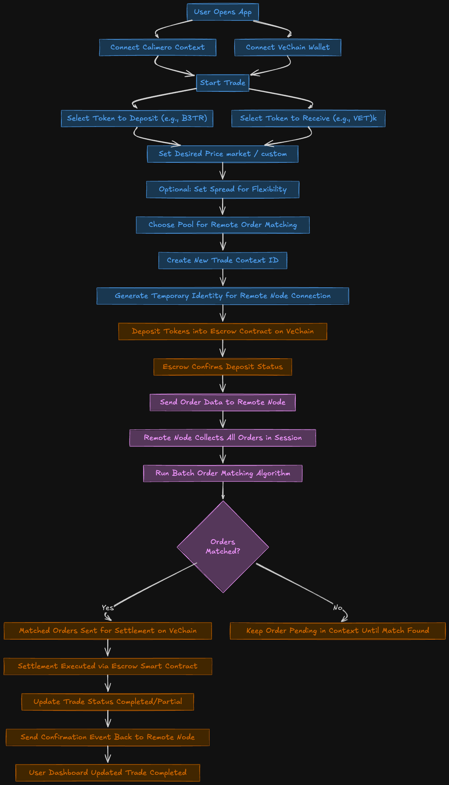

# MeroPools

MeroPools is a decentralized dark pool trading platform that combines privacy-preserving order management with transparent on-chain settlement. Built on Calimero's private context infrastructure and VeChain's blockchain, the application enables confidential trading while maintaining security and verifiability.

## Overview

The platform enables users to place hidden orders with defined price constraints and time limits. Orders remain private within Calimero contexts until matched through a batch processing algorithm executed by remote nodes. Settlement occurs on-chain through VeChain smart contracts that manage token escrow and trade execution.

## Key Features

**Private Order Management**  
Orders are stored in isolated Calimero private contexts, ensuring trade details remain confidential throughout the matching process.

**Batch Order Matching**  
Remote nodes execute batch order matching algorithms to efficiently pair compatible trades while preventing front-running and price manipulation.

**On-Chain Settlement**  
Matched trades are settled through VeChain smart contracts that enforce atomic swaps and maintain an auditable transaction history.

**Decentralized Escrow**  
Funds are held in escrow contracts until both parties' trade conditions are verified and the settlement is executed on-chain.

**Streamlined Interface**  
The user dashboard provides intuitive access to trade execution, order history tracking, and available liquidity pools.

## Architecture



## Getting Started

### Prerequisites

- Node.js (v16 or higher)
- pnpm package manager
- Calimero CLI or dashboard access
- VeChain testnet wallet with test tokens

### 1. Smart Contract Deployment

Deploy the DarkPoolSettlement contract to the VeChain testnet. For detailed instructions, refer to [contracts/README.md](contracts/README.md).

```bash
cd contracts
npm install
npx hardhat run scripts/deploy-darkpool.ts --network vechain_testnet
```

**Deployed Contract Address (Testnet):** `0xc45adc41c6be7d172b7841b072b90c0abb6f663f`

### 2. Frontend Application

Install dependencies and launch the development server:

```bash
cd app
pnpm install
pnpm dev
```

Access the application at `http://localhost:5173`

### 3. Calimero Application

Build the WASM module and deploy to Calimero:

```bash
# Build the WASM module
./logic/build.sh

# Deploy using Calimero CLI or dashboard
# Upload the generated WASM file from logic/res/
```

### 4. Context Initialization

Initialize the required contexts after application deployment:

**User Private Context**

```json
{
  "mode": "UserPrivate",
  "pool_config": null
}
```

**Remote Node Order Matching Context**

```json
{
  "mode": "MatchingPool",
  "pool_config": {
    "pool_name": "Test Pool",
    "min_order_amount": 100000000000000000,
    "max_order_amount": 10000000000000000000,
    "supported_tokens": ["VET", "VTHO"],
    "batch_frequency_seconds": 60,
    "fee_basis_points": 50,
    "created_at": 1696320000000000000
  }
}
```

## Project Structure

```
MeroPools/
├── app/              # Frontend application (React + Vite)
├── contracts/        # VeChain smart contracts (Hardhat)
├── logic/            # Calimero WASM logic (Rust)
└── assets/           # Documentation assets
```

## License

This project is part of the Calimero Network ecosystem.
